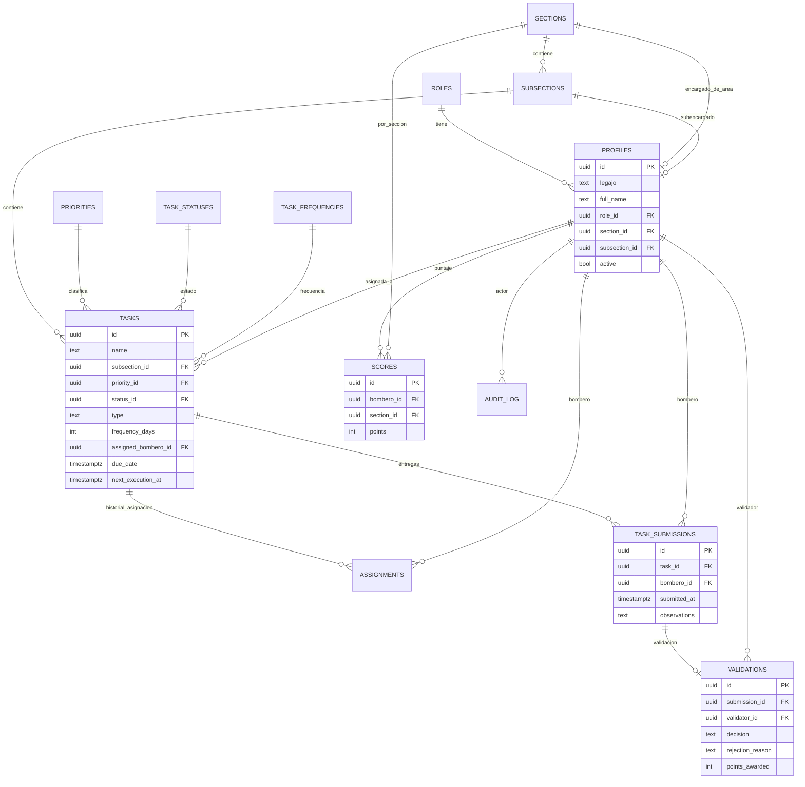

# Tablón de Guardia — Sistema de Gestión de Tareas (versión producción)

Next.js 14 (App Router, TypeScript) + Supabase (PostgreSQL, Auth, RLS). Reemplaza la
versión anterior de un solo archivo HTML: ahora toda la información vive en una base
de datos real, con autenticación de servidor y reglas de negocio configurables.

## ⚠️ Estado de este entregable — leer antes de nada

Este proyecto fue escrito en un entorno sin acceso a internet: no pude ejecutar
`npm install`, ni crear un proyecto Supabase real, ni correr `next build` / `tsc` /
`eslint`, ni desplegar a Vercel. Es decir: **el código está escrito y revisado a mano,
pero no ejecutado**. Vas a tener que hacer el primer `npm install` + build vos (o tu
desarrollador) para encontrar cualquier typo o incompatibilidad de versión que se me
haya escapado — es razonable esperar 1-2 rondas de ajustes menores.

Lo que está **completo y funcional en su diseño**:
- Esquema SQL completo (tablas, relaciones, RLS, triggers, funciones) — es la parte
  más crítica y la que menos margen de error tiene, la revisé con más cuidado.
- Autenticación real por legajo + contraseña vía Supabase Auth (cifrado lo maneja
  Supabase, nunca la app).
- Autorización en el servidor (RLS) — no solo en la interfaz.
- Flujo completo: crear tarea → asignar → bombero finaliza → validación → aprobar/
  rechazar → puntaje automático. Todo pasa por funciones SQL `security definer`
  (`assign_task`, `submit_task`, `validate_submission`), así la lógica de negocio
  vive en un solo lugar y no se puede saltear desde el cliente.
- Auditoría automática (triggers en tareas, perfiles, secciones, subsecciones,
  validaciones, asignaciones).

Lo que está **implementado como patrón, no como CRUD completo en cada pantalla**:
- El módulo de Configuración tiene formularios completos para *Puntuación*,
  *Prioridades*, *Frecuencias* y *Parámetros generales*. *Estados de tareas* y
  *Niveles de desempeño* ya están en la base de datos (editables por SQL o Supabase
  Studio) pero la pantalla los muestra solo en modo lectura — son la misma tabla y el
  mismo patrón de formulario que "Prioridades", así que agregar el CRUD es copiar y
  pegar ese bloque.
- El diseño visual usa los mismos colores/tipografías (Oswald/Inter, paleta
  charcoal/rojo/papel) via Tailwind, pero los componentes son nuevos (React en vez de
  HTML/JS plano) — mantuve el estilo, no pixel-a-pixel la maquetación anterior.

---

## 1. Diagrama de entidades (ERD)



Archivos SQL (en orden de ejecución): `supabase/migrations/0001_schema.sql` →
`0002_functions_triggers.sql` → `0003_rls.sql` → `0004_seed_config.sql`.

---

## 2. Crear el proyecto en Supabase

1. Andá a [supabase.com](https://supabase.com) → **New project**.
2. Elegí nombre, contraseña de base de datos (guardala) y región.
3. Cuando termine de aprovisionar, andá a **Project Settings → API** y copiá:
   - `Project URL` → `NEXT_PUBLIC_SUPABASE_URL`
   - `anon public key` → `NEXT_PUBLIC_SUPABASE_ANON_KEY`
   - `service_role key` → `SUPABASE_SERVICE_ROLE_KEY` (¡nunca la subas a git ni la
     expongas al cliente!)

## 3. Aplicar las migraciones

Con la [CLI de Supabase](https://supabase.com/docs/guides/cli):

```bash
npm install -g supabase
supabase login
supabase link --project-ref <tu-project-ref>
supabase db push
```

O manualmente: abrí **SQL Editor** en el panel de Supabase y pegá el contenido de
cada archivo de `supabase/migrations/` en orden (0001 → 0002 → 0003 → 0004).

## 4. Crear el primer administrador

Como el registro de usuarios lo hace la propia app (`/admin/users`, con service role),
para el primerísimo admin hay que crearlo a mano una vez:

1. En el panel de Supabase → **Authentication → Users → Add user**, con email
   `0001@cuartel.local` (o el legajo que quieras usar) y una contraseña.
2. Copiá el UUID del usuario creado.
3. En **SQL Editor**, corré (reemplazando el UUID):
   ```sql
   insert into public.profiles (id, legajo, full_name, role_id, active)
   values (
     '<uuid-del-usuario>', '0001', 'Administrador',
     (select id from public.roles where code = 'admin'), true
   );
   ```
4. Iniciá sesión en la app con legajo `0001` y esa contraseña. Desde ahí ya podés
   crear el resto del personal desde `/admin/users`.

## 5. Configurar el proyecto localmente

```bash
cp .env.example .env.local   # completar con tus valores de Supabase
npm install
npm run dev
```

Abrí `http://localhost:3000`.

## 6. Desplegar en Vercel

1. Subí este proyecto a un repo de GitHub/GitLab.
2. En [vercel.com](https://vercel.com) → **New Project** → importá el repo.
3. En **Environment Variables** cargá las mismas 3 variables de `.env.example`
   (`NEXT_PUBLIC_SUPABASE_URL`, `NEXT_PUBLIC_SUPABASE_ANON_KEY`,
   `SUPABASE_SERVICE_ROLE_KEY`) + `AUTH_EMAIL_DOMAIN`.
4. Deploy. Vercel detecta Next.js automáticamente (no requiere configuración
   adicional).
5. Verificá el build en la pestaña **Deployments** — ahí vas a ver si hay algún
   error de TypeScript/ESLint que yo no haya podido detectar sin poder compilar acá.

## 7. Regenerar tipos TypeScript reales (recomendado)

Los tipos en `src/lib/types/database.types.ts` los escribí a mano en espejo del SQL.
Una vez que la base esté creada, regeneralos automáticamente para que queden 100%
sincronizados:

```bash
npx supabase gen types typescript --project-id <tu-project-ref> > src/lib/types/database.types.ts
```

---

## 8. Módulo de Inventario de Unidades (nuevo)

Se agregó en `supabase/migrations/0005_inventory.sql`, reutilizando toda la
arquitectura existente — no duplica lógica de asignación, entrega ni validación:

- **`units`**: unidades del cuartel (vehículos/puestos), ligadas a una sección.
- **`inventory_items`**: catálogo global administrable (solo Administrador).
- **`unit_inventory`**: qué elementos y qué cantidad tiene cada unidad — ya trae
  columnas listas para lo que pediste a futuro (`qr_code`, `barcode`,
  `serial_number`, `expires_at`), sin UI todavía.
- **`inventory_movements`**: tabla vacía, lista para transferencias/stock central
  cuando quieras implementarlas — no la usa ninguna pantalla por ahora.
- **`tasks.unit_id`**: nueva columna opcional; si una tarea la tiene cargada, el
  bombero ve el checklist de inventario en vez del botón simple de "Finalizar".
- **Reutilización del flujo existente**: `submit_inventory_review()` llama
  internamente a `submit_task()` (la misma función que ya usaba cualquier tarea) y
  además guarda el detalle por elemento — por eso la aprobación/rechazo la sigue
  haciendo `validate_submission()` sin cambios.
- **Alertas automáticas**: un trigger (`on_review_item_created`) genera una fila en
  `inventory_alerts` apenas un elemento queda en estado con `requires_alert = true`
  (Faltante, Dañado, Requiere mantenimiento — configurable en `item_states`, mismo
  patrón que `task_statuses`). Quedan visibles en **Novedades** hasta que un
  Encargado de Área/Subencargado las resuelve.
- **Permisos**: catálogo global → solo admin. Unidades e inventario por unidad →
  Encargado de Área o Subencargado **de esa sección** (función SQL
  `can_manage_inventory`), igual que pediste. Bomberos: solo lectura durante la
  revisión + registrar el estado de cada elemento.

Páginas nuevas: `/inventory` (catálogo + inventario por unidad),
`/alerts` (novedades), `/tasks/[id]/review` (checklist que ve el bombero cuando la
tarea asignada tiene una unidad vinculada).


```
supabase/migrations/       → esquema SQL, RLS, funciones, seed de configuración
                              (0005 = módulo de inventario)
src/middleware.ts          → protección de rutas + refresco de sesión
src/lib/supabase/          → clientes (browser / server / admin)
src/lib/auth.ts            → helpers de sesión y rol actual
src/app/login/             → login por legajo + contraseña
src/app/(app)/             → app autenticada (sidebar + páginas por rol)
  ├─ page.tsx               dashboard
  ├─ tasks/                 gestión de tareas (crear, asignar)
  │  └─ [id]/review/        checklist de inventario (bombero)
  ├─ validations/           aprobar / rechazar entregas
  ├─ inventory/             catálogo global + inventario por unidad
  ├─ alerts/                novedades (faltante/dañado/mantenimiento)
  ├─ scores/                puntajes por bombero y sección
  ├─ history/                historial completo
  └─ admin/
     ├─ users/               alta/baja de usuarios (Supabase Auth + perfil)
     ├─ sections/            secciones y subsecciones
     └─ config/               puntuación, prioridades, frecuencias, parámetros
```
